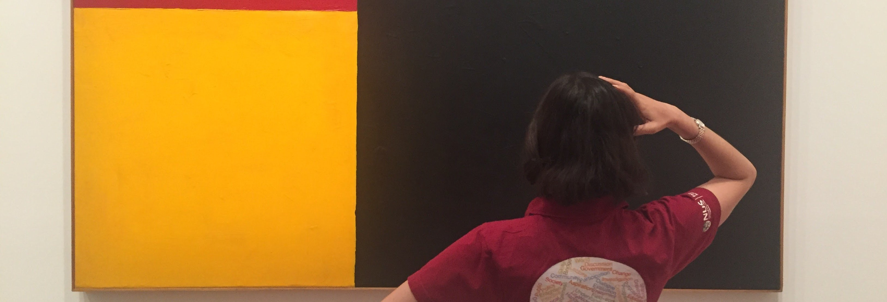

```{r setup, include=FALSE}
knitr::opts_chunk$set(echo = FALSE)

# Learn more about creating blogs with Distill at:
# https://rstudio.github.io/distill/blog.html
```

<br>
<style>
.my-front-welcome-div{
box-sizing: border-box;
width:100%;
height:75px;
line-height:75px;
background:#F8F0DF;
text-align:center;
margin-top:-15px;
}

.my-front-welcome-span{
padding-left:30px;
font-size:22px;
font-weight:normal;
}

</style>


```{r layout="l-screen",results='asis'}
line_1 <- '<div class="my-front-welcome-div"><span class="my-front-welcome-span">'
line_2 <- "'Enchantée... Welcome to Linda Sellou\'s Website'"
line_3 <- '</span></div>'
cat(line_1,line_2,line_3)
```


```{r layout="l-screen"}
# 

```

